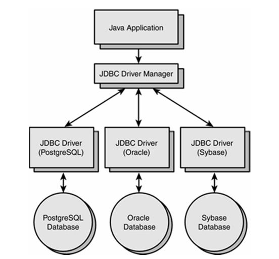

<h1 align="center">Acesso a banco de dados com JDBC </h1>

<h2 align="center">Curso: Programação Orientada a Objetos com Java - Udemy </h2>

Este repositório contém os exercícios e exemplos do curso de JDBC (Java Database Connectivity), abrangendo a teoria e prática da conexão de bancos de dados com Java, utilizando MySQL e o padrão de projeto DAO (Data Access Object).

# Visão geral do JDBC



## Objetivos do Curso

- Conhecer os principais recursos do JDBC na teoria e prática.
- Elaborar a estrutura básica de um projeto com JDBC.
- Implementar o padrão DAO manualmente com JDBC.

## Visão Geral do JDBC

### O que é JDBC?

JDBC é uma API padrão do Java para acessar dados em bancos de dados relacionais. A API fornece interfaces e classes para realizar operações de banco de dados como consulta, atualização e inserção de dados.

### Páginas Oficiais

- [Documentação do JDBC - Oracle](https://docs.oracle.com/javase/8/docs/technotes/guides/jdbc/)
- [API do JDBC - Oracle](https://docs.oracle.com/javase/8/docs/api/java/sql/package-summary.html)

### Pacotes

- **java.sql**: Contém as interfaces e classes fundamentais para JDBC.
- **javax.sql**: API suplementar, utilizada principalmente em servidores.

## Instalação das Ferramentas

1. **MySQL Server** e **MySQL Workbench**:
   - Instale o MySQL Server para rodar o banco de dados.
   - Utilize o MySQL Workbench para interagir com o banco de dados.

2. **MySQL Java Connector**:
   - Baixe o MySQL Java Connector para permitir a conexão entre o Java e o MySQL.
     
3. **Criação do Banco de Dados**:
   - Usando o MySQL Workbench, crie o banco de dados chamado `coursejdbc`.
  
# Estrutura de Pacotes do Projeto

```plaintext
demo_dao_jdbc/
├── application/
│   └── (classes principais da aplicação)
├── db/
│   └── (manipulação da conexão com o banco de dados)
├── model/
│   ├── dao/
│   │   ├── impl/
│   │   │   ├── DaoFactory.java
│   │   │   ├── DepartmentDao.java
│   │   │   └── SellerDao.java
│   └── entities/
│       └── (entidades e modelos do projeto)
└── db.properties (arquivo de configuração do banco de dados)

jdbc/
├── application/
│   └── (classes principais da aplicação)
├── db/
│   └── (manipulação da conexão com o banco de dados)
└── db.properties (arquivo de configuração do banco de dados)

Exemplos de Funcionalidade
Recuperar Dados
Script SQL: material de apoio
Objetos: Statement, ResultSet
Métodos de navegação do ResultSet:
first(): Move para a primeira linha.
beforeFirst(): Move para a posição antes da primeira linha.
next(): Move para a próxima linha.
absolute(int): Move para uma posição específica.
Objetivos:
Recuperar departamentos do banco de dados.
Inserir Dados
PreparedStatement:
Execute operações de inserção no banco de dados.
Exemplo de uso: Recuperação de ID após inserção.
Atualizar Dados
PreparedStatement: Atualize dados no banco com segurança.
Deletar Dados
PreparedStatement: Delete dados de forma segura.
Transações
API:
setAutoCommit(false): Desabilitar autocommit.
commit(): Confirmar transações.
rollback(): Reverter transações.
Padrão de projeto DAO (Data Access Object) 
Cada entidade terá uma classe DAO responsável por fazer o acesso aos dados relacionados àquela entidade.

# Modelo de domínio Chess System


Exemplo:

ClienteDao: Para acesso aos dados do cliente.
ProdutoDao: Para acesso aos dados do produto.
A implementação do DAO deve ser feita em uma interface, e a injeção de dependência pode ser realizada usando o padrão de projeto Factory.

Exemplos de Implementação
SellerDaoJDBC:

# Modelo de domínio department e seller


Exemplo de implementação de DAO para a entidade Seller.
findById:

Consulta de dados utilizando a junção entre as tabelas seller e department.
findByDepartment:

Consulta de vendedores filtrados pelo ID do departamento.
findAll:

Consulta de todos os vendedores, ordenados pelo nome.
Insert/Update/Delete:

Exemplos de consultas SQL para inserção, atualização e exclusão de dados.

